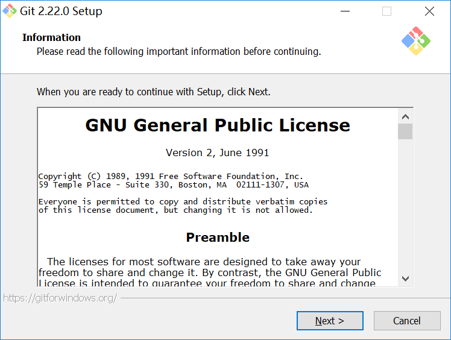
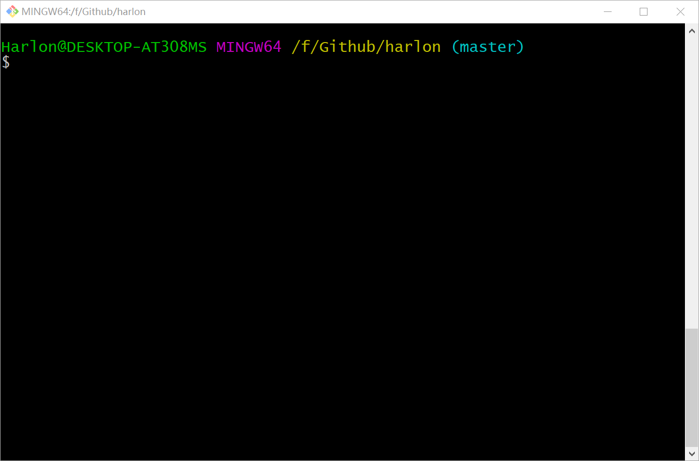

# Git安装和配置

## Git安装

点击下载 [git安装包](https://git-scm.com/downloads)，下载对应系统的安装包，以`Windows`为例：

安装过程比较简单，选择安装位置。



选择默认配置，一直选择`next`，安装完毕之后，会得到两个工具：`git gui`和`git bash`，`git gui`是图形化的方式使用`git`，不推荐使用，`git bash`通过命令行的方式使用`git`，`git bash`也可以认为是`windows`上模拟`Linux`的工具，这里可以执行大部分的`Linux`命令，推荐使用这种方式，不同系统之间可以无缝切换，后面所有的教程都是基于`git bash`命令行的方式进行。`git bash`界面打开方式如下：



检查`git`版本：

``` shell
$ git --version
```

## Git配置

`git`配置文件有三个：

- `/etc/config`：对当前系统上所有的用户和项目都生效，通过`git config --system`命令对该配置文件进行操作。
- `~/.gitconfig`：仅对当前用户生效，通过`git config --global`命令对该配置文件进行操作。
- `.git/config`：项目`.git`目录下的`config`文件，仅对当前项目生效，通过`git config`命令对配置文件进行操作。

安装`git`后，我们需要配置用户名和邮箱。

``` shell
$ git config --global user.name "harlon"
$ git config --global user.email "harlonxl@gmail.com"
```

查看所有配置项。

``` shell
$ git config --list
```

查看某个配置项。

``` shell
$ git config user.name
$ git config user.email
```

`git`帮助文档。

``` shell
$ git config --help
```

