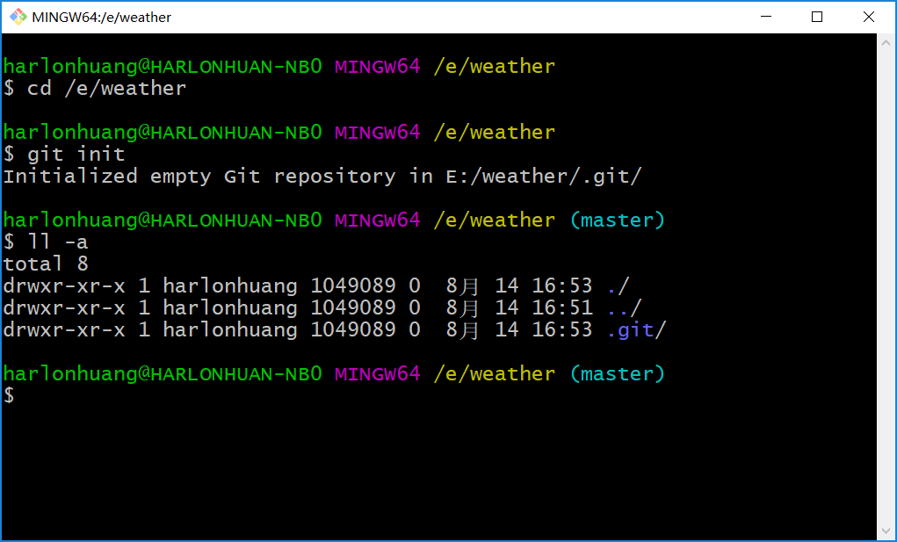
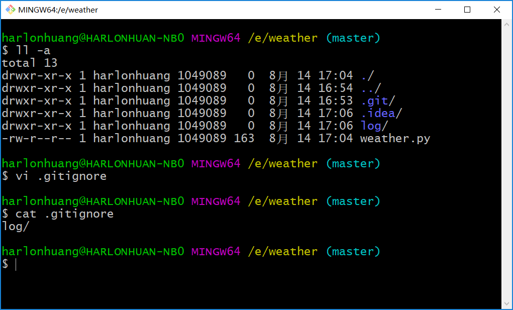
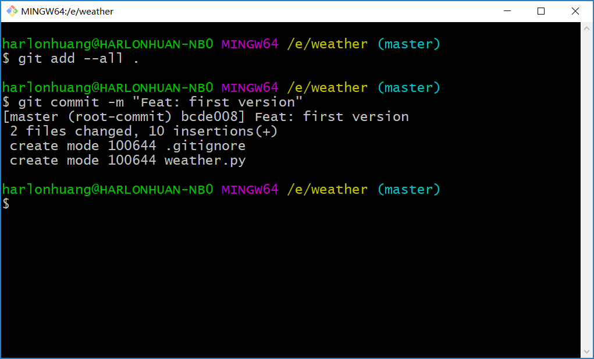
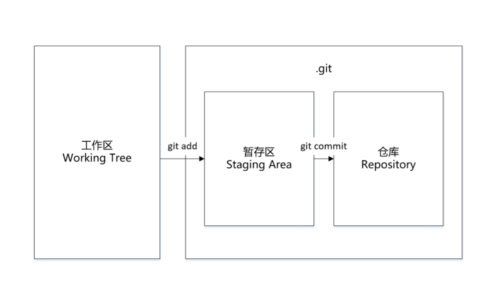

# 图解Git本地代码托管与提交原理

开始之前，为了我们能够更好地理解`git`，我们实现一个小的项目：天气查询工具，从实战中学习`git`的使用，这也是本教程区别其他大多数别的`git`教程的地方，我们介绍的场景都能在工作中体现，而不是为了学习`git`而去学习`git`。

## 初始化

为了能够让`git`托管我们的代码，首先需要对我们的项目进行初始化，生成`git`托管代码需要的一系列文件。



创建`weather`目录，在`weather`目录下执行：

``` shell
$ git init
```

可以看到，在`weather`目录下生成了`,git`目录，这里面包括了`git`的所有文件，每个版本的代码都会存储在`.git`目录中，此时我们完成了`git`托管代码的第一步，初始化`git`托管代码所需要的文件，准备好这个阶段，我们就可以把我们的代码提交给`git`进行管理了。

## 提交

先完成我们项目的第一个版本，创建`weather.py`文件和`log`目录。

``` python
import os
import time
import logging

logging.basicConfig(filename='log/weather.log', level=logging.DEBUG)

if __name__ == '__main__':
    logging.info("Started")
```

完成项目的第一个版本后，需要对这个项目提交到`git`中进行托管，`weather.py`是项目的主要文件，而`log`中的内容时刻会发生变化变化，我们不想对此目录里面的文件进行版本控制，那么我们先要在项目目录中创建文件`.gitignore`，把那些我们不想提交的文件或目录过滤。



提交之前，先禁止`git`自动转换换行符号，`windows`和`linux`类系统下换行方式不一致，`git`提交时会根据当前的系统进行自动转换，通过以下命令关闭自动转换。

``` shell
$ git config --global core.autocrlf false
```

通过以下命令，把我们的代码的第一个版本托管到`git`中。

``` shell
$ git add --all .
$ git commit -m "Feat: first version"
```



接下来完成我们代码的第二个版本。

``` python
import os
import time
import requests
import logging

logging.basicConfig(filename='log/weather.log', level=logging.DEBUG)

class Weather(object):
    def __init__(self):
        self.url = 'http://www.weather.com.cn/data/sk/101020100.html'
    def get_weather_info(self):
        response = requests.get(self.url)
        response.encoding = 'utf-8'
        weather_data = response.json()
        print(weather_data)

if __name__ == '__main__':
    logging.info("Started")
    w = Weather()
    w.get_weather_info()
```

然后提交我们的第二个版本到`git`中。

``` shell
$ git add --all .
$ git commit -m "Feat: get weather from weather.com"
```

## git add和git commit原理



一个`git`项目有3个主要的部分组成：工作区（`Working Tree`），暂存区（`Staging Area`），版本库（`Repository`）

- `Working Tree`：工作区，保存的是当前项目的一个版本对应的所有文件，即我们写代码的地方。

- `Staging Area`：暂存区，包含在`git`版本库中，主要是保存了下一次要提交到的那些文件信息。在`git`中，对暂存区有另外一个名称，叫做`index`，也就是索引。
- ` Repository`：`git`版本库，其实就是`git`用于存储自己的元数据，以及文档数据库的地方，默认就是在项目的`.git`隐藏目录中。

三个区域的协作关系大致如下：

- 在工作区中修改某个版本的文件，修改的文件处于`modified`状态；
- 将修改的文件放入暂存区，准备提交到版本库中，此时处于`staged`状态；
- 执行提交操作，将暂存区中的文件作为一个快照提交到版本库中，此时处于`committed`状态。

## Git机制

`git`有很多独特的机制，这是区别`git`和其他版本控制系统不一样的地方。

### 快照

普通的版本控制系统`cvs`，`svn`等，一开始会提交一个原始文件，然后每次对文件进行修改之后再次提交，通过维护每个版本的差异，就可以通过应用差异，或者回退差异，来前进或者后退文件的版本。

 `git`用的不是这种维护每次提交的差异，而是用的快照。每次提交文件，都是保存一份这个文件当前这个状态的一个完整快照，同时对这次提交维护一个指针，指向这个文件快照。

### 本地化操作

大多数的`git`版本控制操作，只要在本地执行即可，所有的版本文件都在本地，因此操作是非常快的。相比较于那些依赖网络的集中式版本控制系统来说，它们大多数操作要依赖网络，速度比较慢。 

如果我们在飞机或者没有网或者在家里，没有`vpn`的时候，都没有问题，可以在本地开发、提交代码，等有网络的时候，再把提交的版本推送到远程服务器上去。但是`svn`之类的集中式版本控制系统，在没有网络的环境下是不能进行开发的。

### 完整性保证

`git`在存储任何文件之前，都会通过`SHA-1 hash`算法计算一个校验和，这是`git`内核保证的，这样我们是不可以手工修改`git`版本库中的任何文件的，因为修改了文件之后，会导致计算出来的校验和与之前保存的校验和不匹配，导致文件破损。