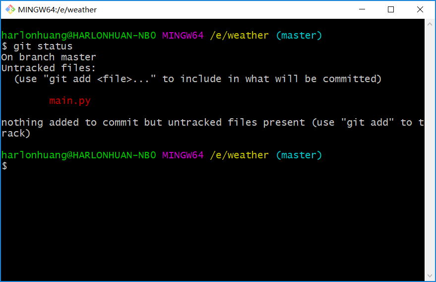
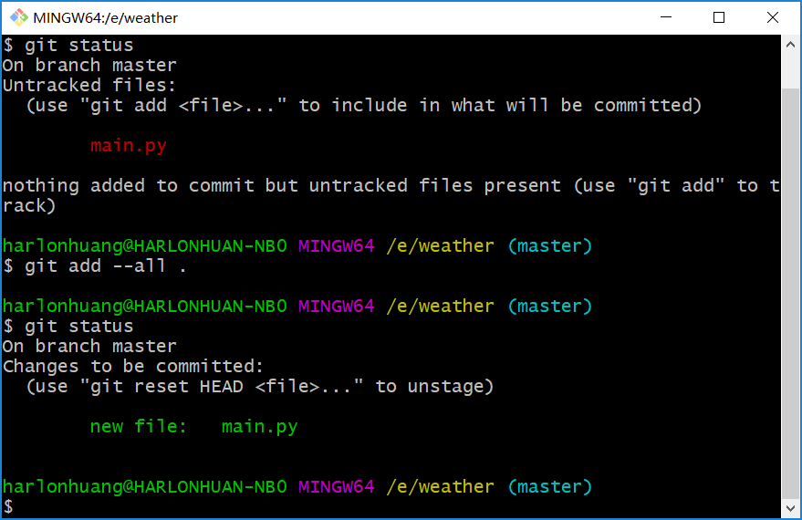
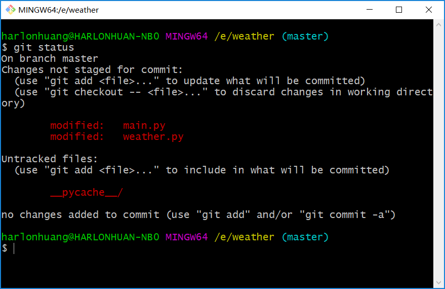
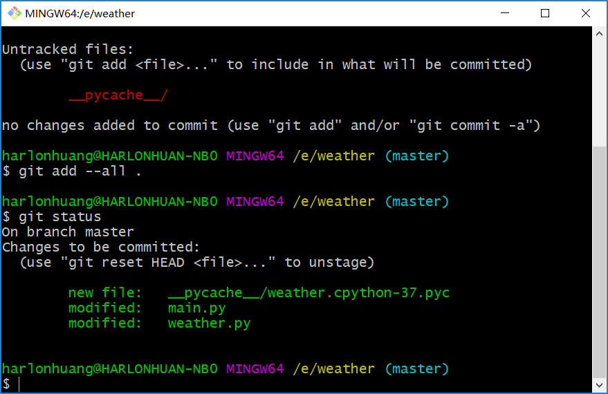
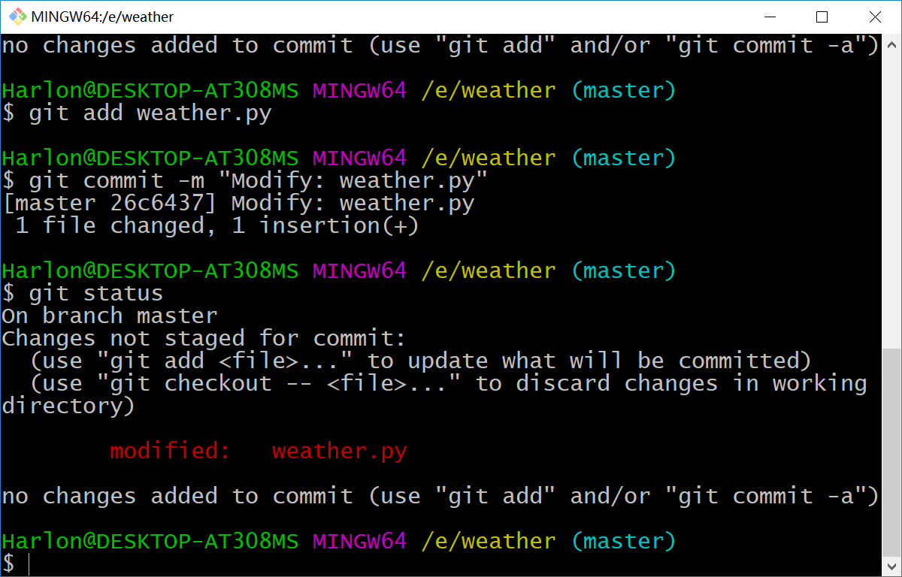

# 深入理解Git状态Step by Step

## Git状态转移

查看文件的状态。

``` shell
$ git status
```

代码文件的状态可以分为两类：

- `tracked`：已追踪，已经提交到`git`的文件，处于`modified`或者`staged`状态。
- `untracked`：未追踪，从来没有提交到`git`的文件。

接着天气查询的项目来说明，新建一个`main.py`，查看当前文件的状态。



此时文件处于`untracked`状态，通过`git add`提交到`git`，再次查看文件的状态。



此时文件处于`new file`状态，`changes to be committed`改变需要被提交，通过`git commit -m "new: add main.py"`提交之后，此时文件被提交到`git`仓库中，处于`committed`状态。

下面我们修改一下两个文件，并查看文件状态。

``` python
# main.py
import logging
from weather import Weather

logging.basicConfig(filename='log/weather.log', level=logging.DEBUG)

if __name__ == '__main__':
    logging.info("Started")
    w = Weather()
    w.get_weather_info()
```

``` python
# weather.py
import os
import time
import requests

class Weather(object):
    def __init__(self):
        self.url = 'http://www.weather.com.cn/data/sk/101020100.html'
    def get_weather_info(self):
        response = requests.get(self.url)
        response.encoding = 'utf-8'
        weather_data = response.json()
        print(weather_data)
```



此时被修改的文件处于`modified`状态，`Changes not staged for commit`改变需要提交到暂存区进行提交，通过`git add --all .`提交代码到暂存区，再次查看文件状态。



此时文件处于`modified`状态，`changes to be committed`改变需要被提交，通过`git commit -m "Feat: 分离mian和weather"`提交代码，此时文件处于`commited`状态。

总结如下：

- 新建的文件：`untracked`，此时仅仅存在中工作区中，未被`git`追踪。
- `git add`新建的文件：`new file`，此时文件已经被追踪，放入暂存区中。
- `git commit`新建的文件：`committed`，此时文件已经被追踪，放入仓库中。
- 修改文件：`modified`，`changes not staged to be committed`，没有放入暂存区，仅存在于工作区中。
- `git add`修改文件：`modified`，`changes to be committed`，修改的版本放入仓库中。

 

## 一个实例来深入理解Git状态

下面我们通过一个实例深入理解`git`状态的变化。

- 修改`weather.py`，我们加入一行注释：

``` python
import os
import time
import requests

# 获取天气信息
class Weather(object):
    def __init__(self):
        self.url = 'http://www.weather.com.cn/data/sk/101020100.html'
    def get_weather_info(self):
        response = requests.get(self.url)
        response.encoding = 'utf-8'
        weather_data = response.json()
        print(weather_data)
```

- 通过`git add weather.py`添加到暂存区。
- 此时，我们再修改一行代码（最后一行）。

```python
import os
import time
import requests

# 获取天气信息
class Weather(object):
    def __init__(self):
        self.url = 'http://www.weather.com.cn/data/sk/101020100.html'
    def get_weather_info(self):
        response = requests.get(self.url)
        response.encoding = 'utf-8'
        weather_data = response.json()
        print(weather_data['weatherinfo'])
```

- 执行`git commit -m "Modify: weather.py"`

此时，执行`git status`会出现什么？



`weather.py`还是处于`modifyed`状态，这是因为`git commit`只是提交了暂存区的代码，而工作区中的代码还是处于`modified`状态。在`git`中，`git add`算做一个版本，每次执行`git add`操作，都会将当前的代码作为一个新的版本放入暂存区中，等待进行提交。

在平常工作中，`git add`和`git commit`是一起使用的，基本不会出现上述的例子的现象，这里仅仅只是为了更好地理解`git`中文件的状态。